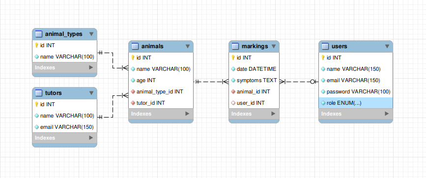

# O Patusco

## Desafio

Queremos ajudar na clínica veterinária "O Patusco". 

A clínica sofre de problemas com filas de espera longas pelos clientes. 

Entram na clínica sem marcação e não conseguimos ter planeamento com médicos a mais e médicos a menos, dependendo das entradas.

Precisamos de um website em Laravel 10/11 e VueJS 3 para:
- O utente poder agendar marcações
  - Nome da pessoa
  - Email
  - Nome do animal
  - Tipo de animal (cão, gato, etc)
  - Idade
  - Sintomas
  - Data (Manhã/Tarde)
- O recepionista da clínica poder
  - ver as marcações por datas e por tipo de animal
  - atribuir as marcações a médicos
  - criar, editar e apagar todas as marcações
- O médico poder
  - Ver as marcações que lhe estão atribuídas, por dias e por tipo de animal
  - Poder editar somente as marcações que lhe estão atribuídas
  - Não pode apagar nenhuma marcação

- Sugerimos usares bibliotecas de frontend (Vuetify, Quasar, Element-Plus, etc) para não consumires muito tempo. 
- Se quiseres separar frontend de backend, podes usar Nuxt ou VueCLI/Vite ou então usar InertiaJS mas não pretendemos Livewire, jQuery ou afins.
- No backend, sugerimos separar bem as responsabilidades de cada componente. Aproveita tudo o que o Laravel te disponibiliza. Mostrarás que dominas a framework.
- Bonus points: testes automatizados

### Modelagem do desafio



- Tabela de usuários - para cadastro de usuário que terá acesso área administrativa. Por exemplo: admin, recepcionista e médico.
- Tabela de marcações - para registro de marcações de consultas e planejamento das agendas de atendimentos dos médicos.
- Tabela de animais - para cadastro dos dados sobre o animal.
- Tabela de tipos de animais - para cadastro dos tipos de animais que a clínica atende.
- Tabela de tutor - para cadastro dos dados do tutor do animal.

### Estrutura do projeto

- Controllers - foi utilizado a ideia de Single Action Controller, então cada ação do projeto possui um controller.
Esse controller recebe a requisição envia para a camada de Actions, após ser processado, o controller realiza a resposta da requisição.
- Requests - cada controller possui um Request para validação dos dados da requisição sendo POST, PUT ou GET, e permissão de execução.
- Resources - para cada entidade possui um Resource para realizar o tratamento do dado que será respondido pelo controler.
- Actions - possui uma Action para cada ação do projeto, que é responsável de realizar o processamento dos dados e enviar para o Repository persistir ou recuperar dados.
- Repositories - responsável pela persistência dos dados.
- Models - que representa cada entidade do banco de dados.

## Executar o projeto

- Copiar o .env:
    ```
    cp .env.example .env
    ```
    
- Executar o composer install no projeto: 
    ```
    docker-compose -f docker-compose-install.yml up -d
    ```

- Subir os containers:
    ```
    docker-compose up -d
    ```

- Subir backend (projeto laravel). URL: `http:localhost:801`:
    ```
    docker exec -it patusco_laravel.test_1 bash
    
    php artisan key:generate
  
    php artisan migrate
  
    php artisan db:seed
    ```

- Subir frontend (projeto nuxt com vuetify). URL: `http:localhost:51731`:
    ```
    docker exec -it patusco_laravel.test_1 bash
    
    cd vuetify-nuxt-project
  
    npm install
  
    npm run dev
    ```
  
- Usuários:
    ```
    Usuário: Admin
    E-mail: admin@example.com
    Senha: password
    
    Usuário: Receptionist
    E-mail: receptionist@example.com
    Senha: password
  
    Usuário: Doctor One
    E-mail: doctorone@example.com
    Senha: password
  
    Usuário: Doctor Two
    E-mail: doctortwo@example.com
    Senha: password
    ```

## Endpoits

Base URLs:

* <a href="http://localhost:801/api">Testing Env: http://localhost:801/api</a>

### Authentication

- HTTP Authentication, scheme: bearer

### Users

### POST /login

> Body Parameters

```json
{
  "email": "admin@example.com",
  "password": "password"
}
```

### Params

|Name|Location|Type|Required|Description|
|---|---|---|---|---|
|Content-Type|header|string| yes |none|
|body|body|object| no |none|
|» email|body|string| yes |none|
|» password|body|string| yes |none|

> Response Examples

```json
{
  "data": {
    "id": 1,
    "name": "Admin",
    "token": "1|1WmojFZWfKEHcoZ2iA3BO7k3ee5RTmKi7APTkHlb7c2d7141"
  }
}
```

### Responses

|HTTP Status Code |Meaning|Description|Data schema|
|---|---|---|---|
|200|[OK](https://tools.ietf.org/html/rfc7231#section-6.3.1)|none|Inline|

### Responses Data Schema

HTTP Status Code **200**

|Name|Type|Required|Restrictions|Title|description|
|---|---|---|---|---|---|
|» data|object|true|none||none|
|»» id|integer|true|none||none|
|»» name|string|true|none||none|
|»» token|string|true|none||none|

### GET /list

### Params

|Name|Location|Type|Required|Description|
|---|---|---|---|---|
|Content-Type|header|string| no |none|

> Response Examples

> 200 Response

```json
{
  "data": [
    {
      "id": 0,
      "name": "string",
      "email": "string"
    }
  ]
}
```

### Responses

|HTTP Status Code |Meaning|Description|Data schema|
|---|---|---|---|
|200|[OK](https://tools.ietf.org/html/rfc7231#section-6.3.1)|none|Inline|

### Responses Data Schema

HTTP Status Code **200**

|Name|Type|Required|Restrictions|Title|description|
|---|---|---|---|---|---|
|» data|[object]|true|none||none|
|»» id|integer|false|none||none|
|»» name|string|false|none||none|
|»» email|string|false|none||none|

# Markings

## POST create

POST /markings

> Body Parameters

```json
{
  "animal": {
    "name": "Ted",
    "age": 5,
    "animal_type": {
      "id": 1
    },
    "tutor": {
      "name": "John",
      "email": "john@example.com"
    }
  },
  "symptoms": "test test testt",
  "date": "2024-11-14",
  "hour": "14:00"
}
```

### Params

|Name|Location|Type|Required|Description|
|---|---|---|---|---|
|Content-Type|header|string| no |none|
|body|body|object| no |none|

> Response Examples

> 200 Response

```json
{}
```

### Responses

|HTTP Status Code |Meaning|Description|Data schema|
|---|---|---|---|
|200|[OK](https://tools.ietf.org/html/rfc7231#section-6.3.1)|none|Inline|

### Responses Data Schema

## GET list

GET /markings

### Params

|Name|Location|Type|Required|Description|
|---|---|---|---|---|
|Content-Type|header|string| no |none|

> Response Examples

> 200 Response

```json
{
  "data": [
    {
      "id": 0,
      "date": "string",
      "animal": {
        "id": 0,
        "name": "string",
        "age": 0,
        "animalType": {
          "id": 0,
          "name": "string"
        },
        "tutor": {
          "id": 0,
          "name": "string",
          "email": "string"
        },
        "user": null
      }
    }
  ]
}
```

### Responses

|HTTP Status Code |Meaning|Description|Data schema|
|---|---|---|---|
|200|[OK](https://tools.ietf.org/html/rfc7231#section-6.3.1)|none|Inline|

### Responses Data Schema

HTTP Status Code **200**

|Name|Type|Required|Restrictions|Title|description|
|---|---|---|---|---|---|
|» data|[object]|true|none||none|
|»» id|integer|false|none||none|
|»» date|string|false|none||none|
|»» animal|object|false|none||none|
|»»» id|integer|true|none||none|
|»»» name|string|true|none||none|
|»»» age|integer|true|none||none|
|»»» animalType|object|true|none||none|
|»»»» id|integer|true|none||none|
|»»»» name|string|true|none||none|
|»»» tutor|object|true|none||none|
|»»»» id|integer|true|none||none|
|»»»» name|string|true|none||none|
|»»»» email|string|true|none||none|
|»»» user|null|true|none||none|

## PUT update

PUT /markings/1

> Body Parameters

```json
{
  "animal": {
    "name": "Ted",
    "age": 5,
    "animal_type": {
      "id": 1
    },
    "tutor": {
      "name": "John",
      "email": "john@example.com"
    }
  },
  "symptoms": "test test testt",
  "date": "2024-11-14",
  "hour": "14:00",
  "user": {
    "id": 1
  }
}
```

### Params

|Name|Location|Type|Required|Description|
|---|---|---|---|---|
|Content-Type|header|string| no |none|
|body|body|object| no |none|

> Response Examples

> 200 Response

```json
{}
```

### Responses

|HTTP Status Code |Meaning|Description|Data schema|
|---|---|---|---|
|200|[OK](https://tools.ietf.org/html/rfc7231#section-6.3.1)|none|Inline|

### Responses Data Schema

## GET get

GET /markings/1

### Params

|Name|Location|Type|Required|Description|
|---|---|---|---|---|
|Content-Type|header|string| no |none|

> Response Examples

> 200 Response

```json
{
  "data": [
    {
      "id": 0,
      "date": "string",
      "animal": {
        "id": 0,
        "name": "string",
        "age": 0,
        "animalType": {
          "id": 0,
          "name": "string"
        },
        "tutor": {
          "id": 0,
          "name": "string",
          "email": "string"
        },
        "user": null
      }
    }
  ]
}
```

### Responses

|HTTP Status Code |Meaning|Description|Data schema|
|---|---|---|---|
|200|[OK](https://tools.ietf.org/html/rfc7231#section-6.3.1)|none|Inline|

### Responses Data Schema

HTTP Status Code **200**

|Name|Type|Required|Restrictions|Title|description|
|---|---|---|---|---|---|
|» data|[object]|true|none||none|
|»» id|integer|false|none||none|
|»» date|string|false|none||none|
|»» animal|object|false|none||none|
|»»» id|integer|true|none||none|
|»»» name|string|true|none||none|
|»»» age|integer|true|none||none|
|»»» animalType|object|true|none||none|
|»»»» id|integer|true|none||none|
|»»»» name|string|true|none||none|
|»»» tutor|object|true|none||none|
|»»»» id|integer|true|none||none|
|»»»» name|string|true|none||none|
|»»»» email|string|true|none||none|
|»»» user|null|true|none||none|

# AnimalTypes

## GET list

GET /animal-types

### Params

|Name|Location|Type|Required|Description|
|---|---|---|---|---|
|Content-Type|header|string| no |none|

> Response Examples

> 200 Response

```json
{
  "data": [
    {
      "id": 0,
      "date": "string",
      "animal": {
        "id": 0,
        "name": "string",
        "age": 0,
        "animalType": {
          "id": 0,
          "name": "string"
        },
        "tutor": {
          "id": 0,
          "name": "string",
          "email": "string"
        },
        "user": null
      }
    }
  ]
}
```

### Responses

|HTTP Status Code |Meaning|Description|Data schema|
|---|---|---|---|
|200|[OK](https://tools.ietf.org/html/rfc7231#section-6.3.1)|none|Inline|

### Responses Data Schema

HTTP Status Code **200**

|Name|Type|Required|Restrictions|Title|description|
|---|---|---|---|---|---|
|» data|[object]|true|none||none|
|»» id|integer|false|none||none|
|»» date|string|false|none||none|
|»» animal|object|false|none||none|
|»»» id|integer|true|none||none|
|»»» name|string|true|none||none|
|»»» age|integer|true|none||none|
|»»» animalType|object|true|none||none|
|»»»» id|integer|true|none||none|
|»»»» name|string|true|none||none|
|»»» tutor|object|true|none||none|
|»»»» id|integer|true|none||none|
|»»»» name|string|true|none||none|
|»»»» email|string|true|none||none|
|»»» user|null|true|none||none|
